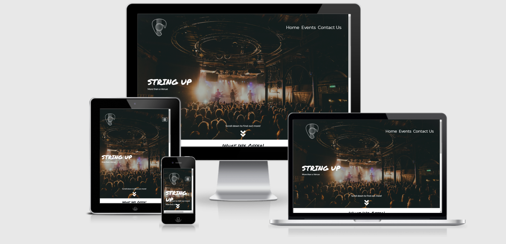
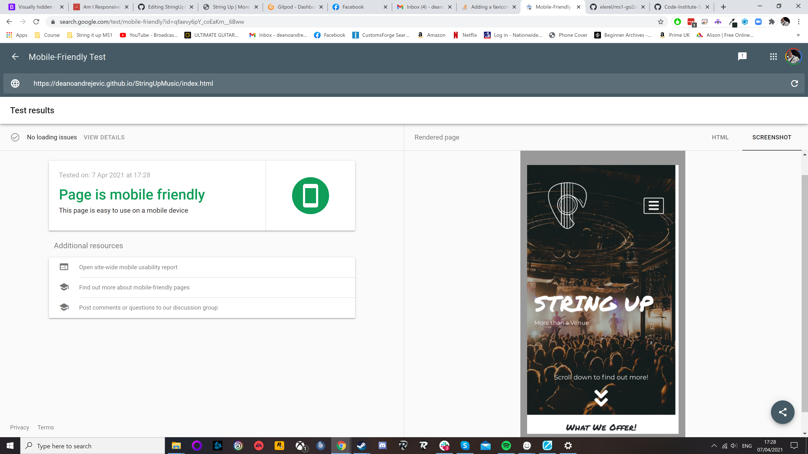
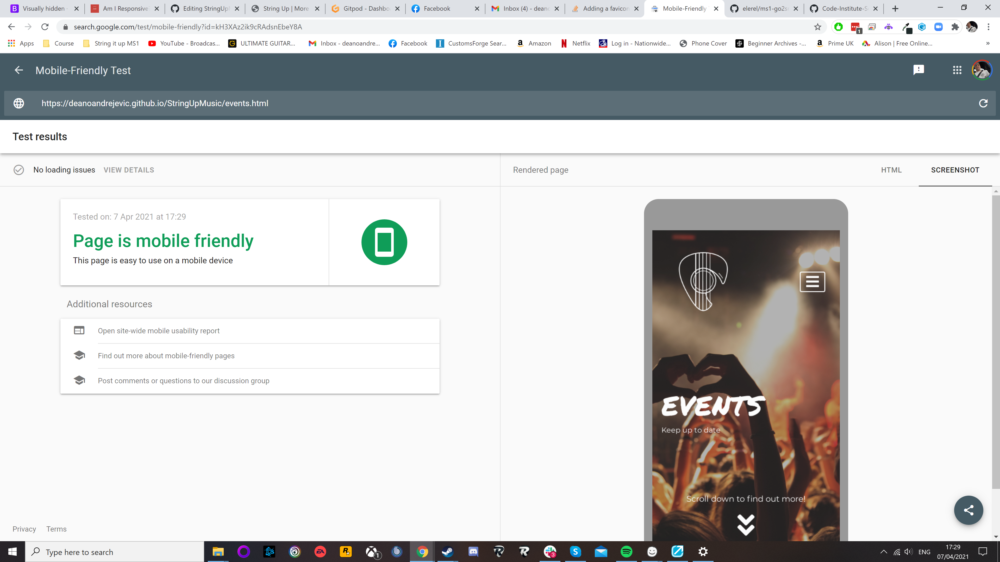
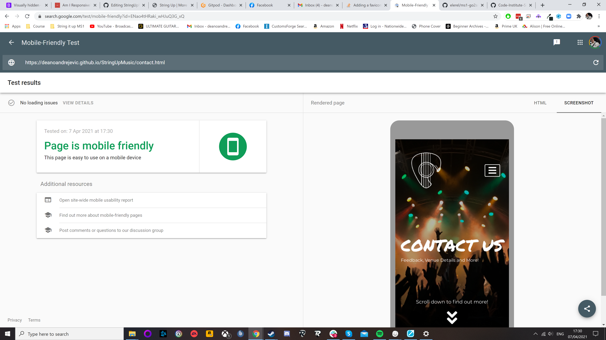
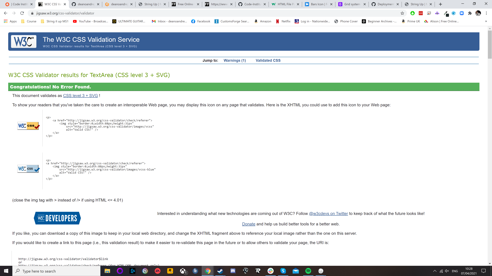
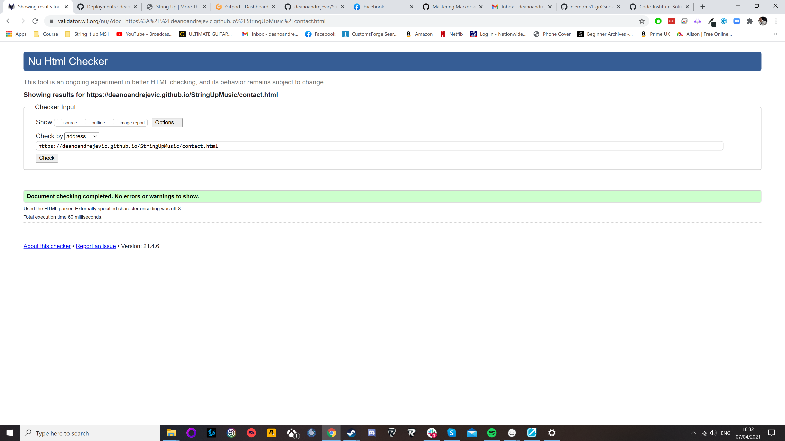
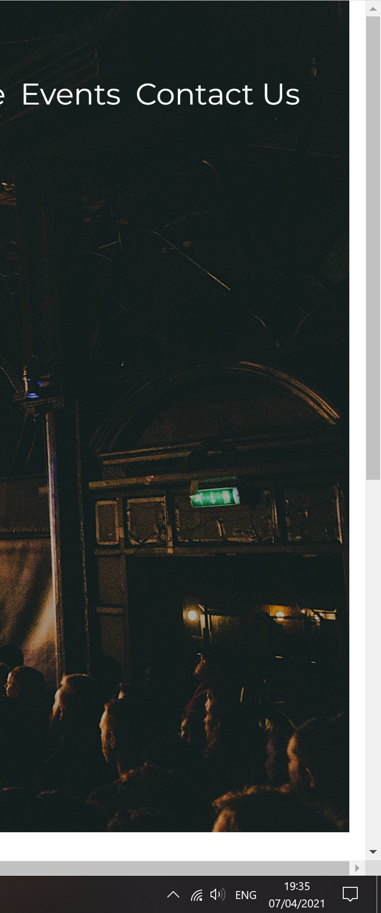
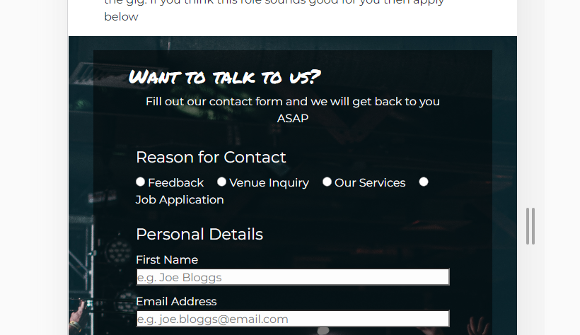

# String Up Music

## Project Goals

This website is for String Up, a fictional music venue and shop for my Milestone Project 1. The aim of the website is to be intuitive and clean. 
It also needs to be easy to use and look good

# User Experience (UX)

- ## User Stories

    - ### First time user 

    1. I want to be able to know exactly what the message of the site is with minimal digging.
    2. I want to be able to know exactly where to go if I need something specific.
    3. I want to be able to find out which events the venue are holding and when.
    4. I want to be able to give feedback to the company, or enquriy about a service.

    - ### Regular Users

    1. I want to explore new features as and when they go live on the page.
    2. I want to be notified of upcoming events and workshops that apply to me.
    3. I want to check up on job listings as they pop up.

    - ### Business Goals

    1. As a business I want to be able to keep customer up to date about what is going on and what is upcoming.
    2. I want to be able to excited user with potenial new features that may benefit them like, subscriptions.
    3. I want to be able to advertise what exactly we do as a company, in terms of what services we offer and what sort of events we do.

# Scope

-  This website adopts a minimal style. Sometimes known as Minimal Viable Product. This has many advantages such as.

1. good for early adopters to the site
2. conveys enough information on the site to effectivly get the message across
3. Also it helps myself, as I am fairly new to this it fits my knowledge and my skill level well

This site is about the music, and I really want to be able to get that across. The home screen hits you straight away with a picture of a 
concert. The logo is consistent across the whole site which also has it's musical touch. Music is a very personal for a lot of people and 
by hitting them fast with images of concerts helps invites the customer in to the site and explore around. It will also encourage them to
hopefully get in touch with us and ask us anything they like.

# Structure

- The original plan was to go for a 4 page website, but I ultimatly decided to go with just a three page site. The reason being is purely based on my own
skill level. I didn't want to be to ambitious and then as a result the rest of the site suffer. The home page is designed to intice
you in straight away. It is also designed to encourage the user to scroll and explore straight away. The homepage will have a small section that will
concisely explain what String Up does. We will then move on to the events page. This is fairly self explaintary, this page will explain what the upcoming
events are. It will also say what date it is and also where to buy tickets to the events. It will layed out so it is easy to read and even easier on mobile.
The final page is the contact page. This page will invite you to contact String Up. It will also display job opportunities using the bootstrap 
grid system, which will make it accessible for everyone regardless of device. The footer will be displayed across all pages, it will just contain a small amount of
information about the company, social media platforms, partners of String Up and License information for the venue itself. The total goal of this is create an attractive
yet informative website.

# Wireframes

- My wireframes are basically exactly the same as my actually website. The biggest difference is on the events page. Where there was meant to be gradual reduction in the amount of events
per row. I couldn't quite achieve that. so it ended up being 3 events per row straight down to 1 per row.

- Wireframe of Home Page [Click Here](assets/images/Home-Page.png)
- Wireframe of Events Page [Click Here](assets/images/Events-Page.png)
- Wireframe of Contact Us Page [Click Here](assets/images/Contact-page.png)

# Design 

## Color Scheme 

- The Colour scheme is kept very simple, just a greyscale design for the site. The main reason for this is the pictures do a lot of the talking. The only custom
colour is #1f2b2b which is a dark slate grey, this colour is used for the footer and the hover psuedo element for the submit and reset buttons.

## Typography

- The Typography for the body is 'Lato' which is part of the google fonts family. For the h1 h2 h3 h4 headings I used the 'Permanent Marker' font, which
is also part of the google fonts family. Also part of that Typography I have used some icons from Font awesome.

## Imagery

- Music is powerful and just thinking about a concert can give you a good feeling. So that was the idea of the picutres used. They are there to instantly give the
user a instant sense of happiness.

# Feature

## Navbar + Hero 

- The navbar is made up from bootstrap with a few of my own modifications. The nav bar itself was originally set to being a light color through the bootstrap default, but I deleted that
atribute to make it transparent, and moved the nav-links over to the right. The company logo is also incorperated into the nav bar and floated over to the left. I elected for the nav to be
transparent as I personally think it gives it a much cleaner and neater look. The company logo also acts as an always home button as well as the normal home button.
As I keep going back to, the feeling of music is typically a good one and that is the very reason why not just on the home screen, all of the pages have a "hero-image" that is meant
to incite a good feeling and also and inviting feeling. All of the hero images also have the current page name and a very short description of what the page is about.

## What We Offer

- The home page has small section that will tell you what String Up is about.

## Events

- The events page on desktop is 2 rows of 3 and 6 rows of 1 on mobile devices. This sections is meant to tell you exactly what is going on and when.

## Contact From 

- The contact form is there for a few different purposes, whether you want to give feedback to String Up, enquire about services that String Up offer or send in a job application.

## Footer

- The footer is there across all the pages, it's main purpose is to tell everyone a little bit about String Up, its partners and the Licenses it holds to trade how it does. 
the footer does contain all String Ups social medias too, which is a great extra addition to what the website offers as it will provide extra information.

## Responsive Design

- The Responsive design is across the whole site. It is mobile and tablet friendly. 

## Features yet to be implimented

- I would like to add a comprensive and detailed description of the services that String Up offer.
- I would like to add a shop feature where users can buy equipment and book the services that String Up will offer.
- I would like to add a gallery, though a basic version of this would have been within the scope of this project but I would like to impliment a more complex version where users
can expand, and potenially even download pictures in multiple resolutions.

# Technologies Used

### Languages:

- [HTML](https://en.wikipedia.org/wiki/HTML5)

- [CCS](https://en.wikipedia.org/wiki/CSS)

### Libraries:

- [Bootstrap-V5](https://en.wikipedia.org/wiki/Bootstrap_(front-end_framework)) Bootstrap is a free and open-source CSS framework directed at responsive, 
mobile-first front-end web development. They was also extensive use of the bootstrap grid system and bootstrap navbar and toggler

- [Google Fonts](https://fonts.google.com/) Permanent Marker and Monserrat fonts used.

- [Font Awesome](https://fontawesome.com/) Many icons used through the project.

- [Balsamiq](https://balsamiq.com/) Balsamiq was used to make my wireframes and general design of my website.

### Version Control:

- [GitHub](https://github.com/) GitHub was used for storage of code and deployment of page via GitHub Pages.

- [GitPod](https://www.gitpod.io/) GitPod was used as the primary editor and also to push and commit my code.

### Other:

- [Google Dev Tools](https://developer.chrome.com/docs/devtools/) Google Chrome Dev Tools was a huge help in discovering bugs and figuring out the solution before actually
commiting it to my own code. 

- [Code Institute](https://codeinstitute.net/) The Code Institute is where all my current coding knowledge has come from.

- [w3schools](https://w3schools.com) Used frequently for advice and tips on certain parts of my code, especially to do with flex box in css.

- [AmIResponsive](http://ami.responsivedesign.is/) Was used to test what the web pages would look like across multiple devices.

- [Google Mobile Friendly Test](https://search.google.com/test/mobile-friendly) Was used to see if my pages were mobile friendly.

- [FreeFormatter](https://www.freeformatter.com/css-beautifier.html) Was used to beautify CSS code.

- [Lighthouse](https://developers.google.com/web/tools/lighthouse) Was used to test performance, SEO, accessibility and best practices

# Testing

## Form Testing
- I have tested the form on multiple devices, of different resolutions. The submitted form goes nowhere as expected. Also the form input that are required to be filled out do
show as "please fill in this form" This is the case on all devices.

## Link Testing
- external links have been tested from multiple devices and of multiple resolutions. They all open in new tabs as they should. internal links have also been tested in the same
same peramiters and everything works as expected. The social links are font awesome icons with the visually-hidden bootstrap attribute attached for screen readers. The links for fender, gibson, ernie ball, gov uk, ppl and ticketweb are coloured in white to help with contrast and but they still have the text-decoration so you can easily tell the difference between what is a link and what is text

## Devices tested on
- I have tested on primarly android devices as that is what I have and the rest of the family too. I did also have a few friends help me out too and just make sure everything is working for me. 

## Devices tested on:
- Google Pixel 4XL
- Moto G 5G Plus
- Samsung Galaxy A21
- Samsung Galaxy A12
- Moto E Macro
- Lenovo Tab P11
- Amazon Fire Tablet 10"
- iPhone 12 Pro
- iPhone 12 Pro Max
- iPhone 11 Pro
- Google Chromebook
- Windows 10 PC - 1920x1080 + 3840x2160

I have also run my code through the Google Mobile Friendly Test. Results are below for each page.

1. 

2. 

3. 

I also tested these sites out on Chrome, Firefox, Opera, Edge and even an older version of internet explorer.

## Validation:

Results for CSS

1. 

Results for HTML

1. 

2. 

3. 

## Project Bug and Solutions

- I only experienced two bugs through out the whole project, any of the other issues I had were only there because I created them by playing about, and when I created the issue if i didn't want to carry on with it I just reversed it. I will outline the 2 bugs I am having here.

These two bugs are ones I am currently still experiencing and am in the process of fixing, If i manage to fix them I will outline how I have done so.

1. I am having an issue where there is a small thin white gap down the right side of all the pages. I believe it is caused by the navbar, as I have had similar issues in the past.

*UPDATED*
Issues is now fixed. I changed the navbar attribute to have 100% width. There is now no gap and issues is fixed regardless of screen size.

2. The only other issue I am having is the radio check boxes and the labels are splitting which is looking ugly and untidy. I think this can be fixed by doing a display: inline-block. I can't be 100% sure until I try

*UPDATED*
By adding a media query for a smaller resolution and changing the display of the label display to display:block; and adding a bottom margin to space the options out so it doesn't make it confusing. It doesn't look 100% but it is pretty decent fix until I can figure out a more permanent one! 

# User Story Testing

## I want to be able to know exactly what the message of the site is with minimal digging.
- You are immediatly greeted with a picture of a concert which indicates the website has something to do with music and gigs, You are also greeted to the heading of String Up "More than a venue" which clearly indicates something to do with music and more.

## I want to be able to know exactly where to go if I need something specific.
- You don't have to look to far to find our where you want to go on the site. The top right hand corner of the page there are options for Home, Events and Contact Us. Also there is the universal menu button which will reveal the options when on mobile. Also there is a scroll down icon which indicates there is more to look at!

## I want to be able to find out which events the venue are holding and when.
- You just have to click on the events tab and you will find all the events that are upcoming. You will also find ticket information and how to get them! There is scope in the future to add more events to the page!

## I want to be able to give feedback to the company, or enquriy about a service.
- When you click on the contact us form. The form should have everything you needs to make an enquiry. You will not only find a form to fill out but you will also find job oppotuntities

#Regular User Stories

## I want to explore new features as and when they go live on the page.
- They is currently nothing new on the website aprt from what was already there. but having the form in place means we can send the customer updates about the site and new services as and when they go live.

## I want to be notified of upcoming events and workshops that apply to me.
- Once again by signing up through our contact form you will get updates to upcoming events. The website can also be updated frequently for when a new date gets added and when an event passes it can get taken so not to confuse users.

## I want to check up on job listings as they pop up.
- The aim is to have a lot of communication with users esspecially those actively seeking a career with us. When they send in our contact form we will tell them if they have been successful and they will also be told if they have not been successful. Also by supplying us with your mobile number we can keep in touch via text. We will also keep the site updated with new jobs listing when they come up

#Deployment
